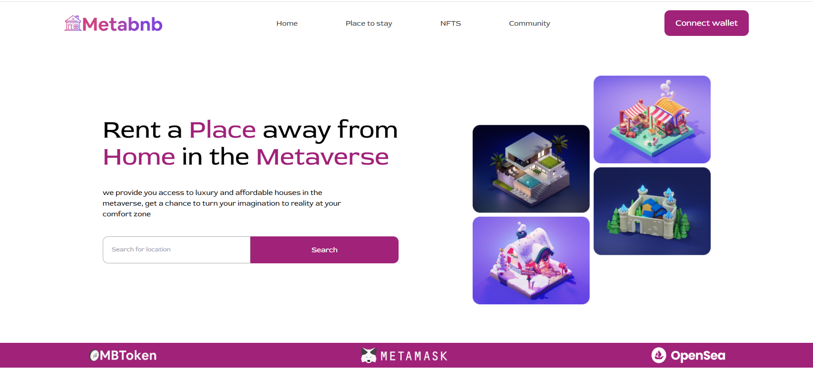

# Metabnb

This is a website that provide you access to luxury and affordable houses in the metaverse, get a chance to turn your imagination to reality at your comfort zone Search for location Search.

My goal here is to Build a single page web application for metaverse using the React library, Click [here](https://metabnb-site.netlify.app) to get a live preview of the project.. 

## Built With

-React
-Tailwind

To get a local copy up and running follow these simple example steps.

### Prerequisites

The basic requirements for building the executable are:
- Have a good knowledge on javascript objects
- Have VSCode or other text editor installed. [Link to download VSCode](https://code.visualstudio.com/download)
- Install node package. [Link to download node](https://nodejs.org/en/download/)
- Have git installed.[Link to download git](https://git-scm.com/downloads)
- Create a github repository.

### Setup
- git clone  https://github.com/usorfaitheloho/metabnb.git <Your-Build-Directory>

## Authors

👤 **Faith Eloho usor**

- GitHub: [@githubhandle](https://github.com/usorfaitheloho)
